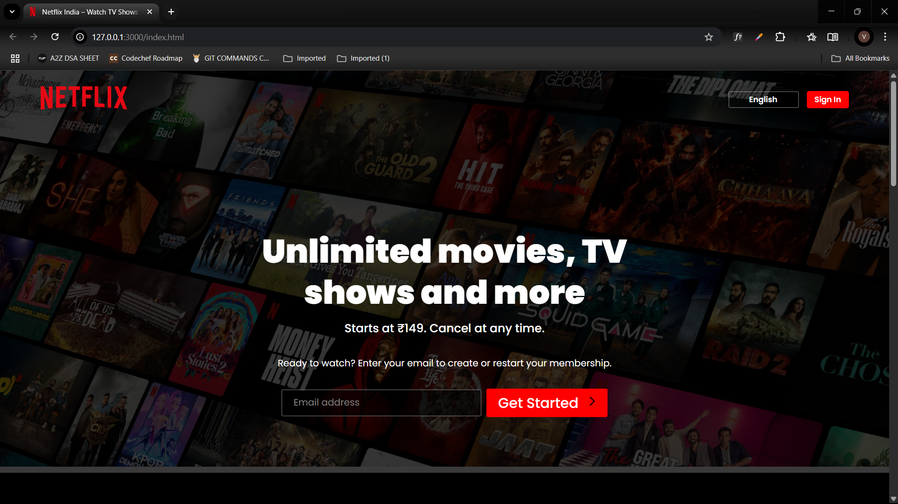
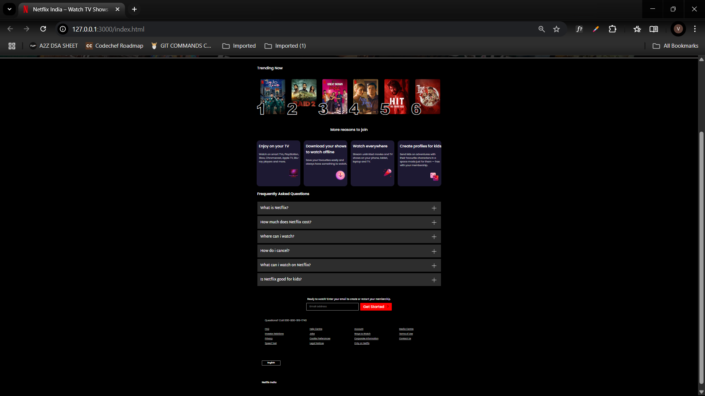

# 🎬 NETFLIX Clone - HTML/CSS

This is my very first hands-on project in web development — and trust me, building this was a lot of fun!  
After gaining a solid understanding of HTML and CSS, I decided to challenge myself with a frontend clone of the Netflix landing page.

This project helped me reinforce core layout concepts, responsiveness, and clean structuring using only HTML and CSS.

---

## 🚀 Features

- 🎨 Pixel-perfect design resembling the official Netflix homepage
- 📱 Fully responsive and optimized for all screen sizes
- 🧱 Clean, semantic, and well-structured HTML and CSS
- ⚙️ Organized code using Flexbox and CSS Grid

---

## 📸 Screenshots

> These show how the website looks for your easier reference:

---

## 🛠️ Technologies Used

- **HTML5**
- **CSS3**
- **Flexbox & Grid Layouts**
- **Google Fonts**
- **GetFont**
- **Figma** 
- **Chrome DevTools** 

---

## 📝 Reflections

As this was my very first web development project, I approached it with the goal of applying everything I’ve learned so far in HTML and CSS. It was an incredibly fun and rewarding 8-hour experience — though I’ll admit, getting the responsiveness just right definitely had me scratching my head! 😅

Still, it pushed me to think deeper and problem-solve like a real developer. I’m proud of how it turned out, and even more excited to continue my journey — next up: **JavaScript**! 🚀

---

## 🎯 What I Learned

- Structuring HTML documents for scalability
- Making responsive layouts using Flexbox and Grid
- Selecting fonts and colors to match real-world UI
- Inspecting and debugging with browser tools
- Building confidence through practical frontend development

---

